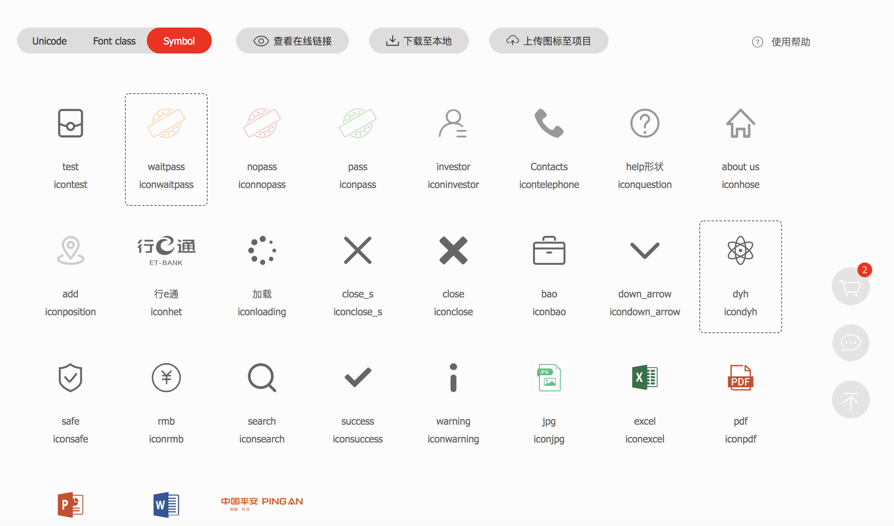
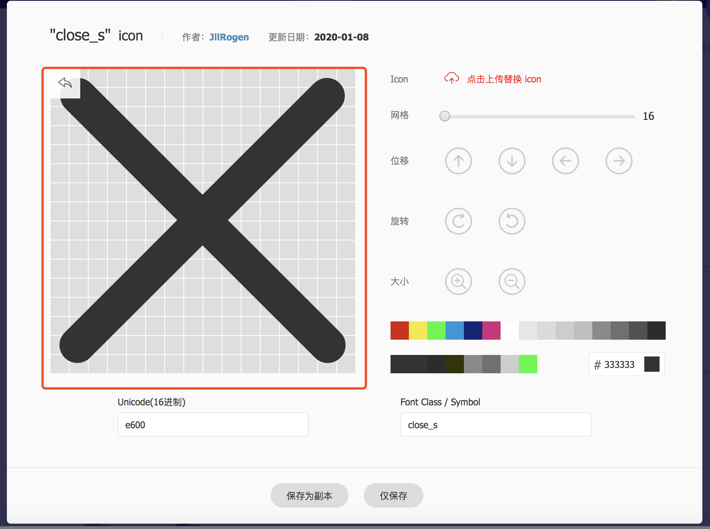

# svg icon 图标规范

- 约定所有的icon图标都是svg的文件格式. 

- 所有svg图标需上传到`iconfont`网站上面, 方便共享. [项目地址](https://www.iconfont.cn/manage/index?spm=a313x.7781069.1998910419.db775f1f3&manage_type=myprojects&projectId=1194299)

- iconfont 里面UI给出的图标, 上传以后需要将图标图标,调整到最大的位置,撑满, 后面才能从iconfont上下载到项目中使用. 

- 从iconfont上下载下来的图标放到项目文件夹下面, 需要经过测试(保证图标使用的时候能改变大小, 改变颜色), 在demo下面的`iconDemo`页里面写好测试案例.
::: warning 
svg图标下载后如果不能通过 `color` 属性改变颜色, 需要将svg源码中的 `fill` 属性去掉.
:::
