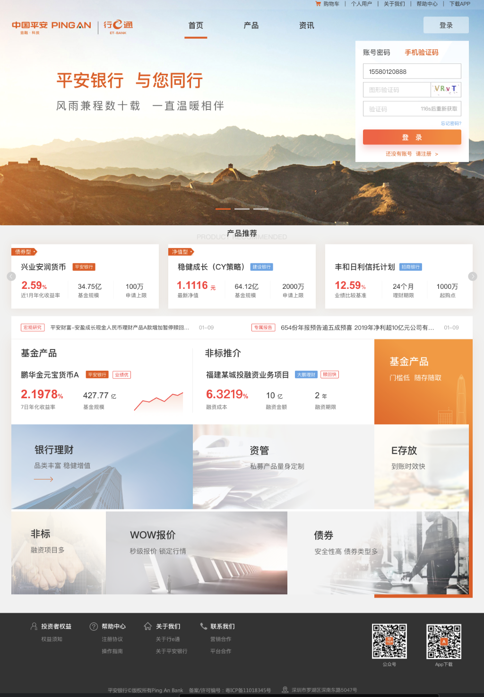
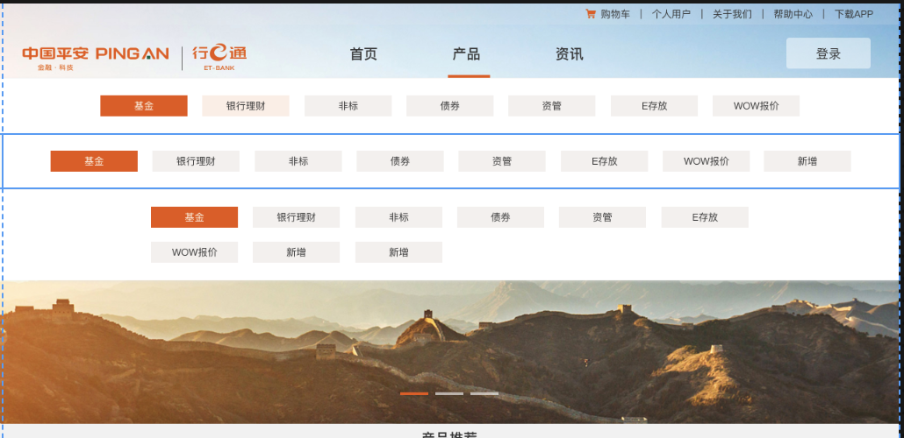
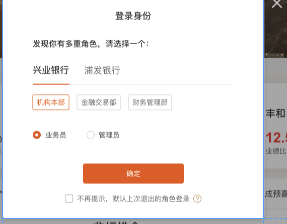

# 首页

> 责任人: 蒋力龙

---

## 预览

产品弹出窗

多机构弹窗

---

## 区域划分

### Banner 区域

- banner 区域依赖 `Carousel走马灯`组件实现滚动(图片没有加载完前, 要有默认图片)
- 滚动参数:
  - 自动滚动(2 秒一次)
  - 显示滚动的标识符

---

### 产品推荐区域

产品区域分为上下两功能块

- 智能推荐产品
  - 总共多个智能推荐产品, 可用点击该区域的左右箭头进行产品的滚动
  - 可自动滚动, 每3秒滚动一次, 循环滚动.小于等于3个就不自动滚动

* 宏观研究, 专属研报... (如果数据没有就不展示, 数据来源于资讯)

  ??????????

- 热推区域
  - 两个热推产品 + 7 个模块
  - 第一个产品的曲线图取一年的数据.
  - 接口: `/hotPro`

---

## 接口
- banner列表接口
    - 接口号: ...
    - 输出: url , link(全路径), type(图片或视频)

- 模块列表接口
  - 接口号: ....
  - 输出: title, desc

- 折线图数据接口(不考虑)
  - 接口号: ...
  - 输出: 

## 其他

> 首页滚动的时候布局顶部的背景动态设置(透明---白色), 根据滚动的位置.
